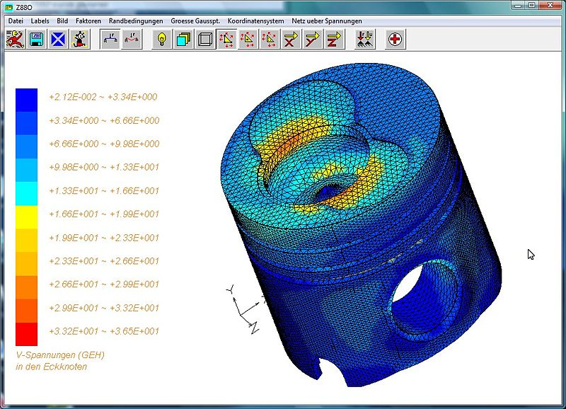
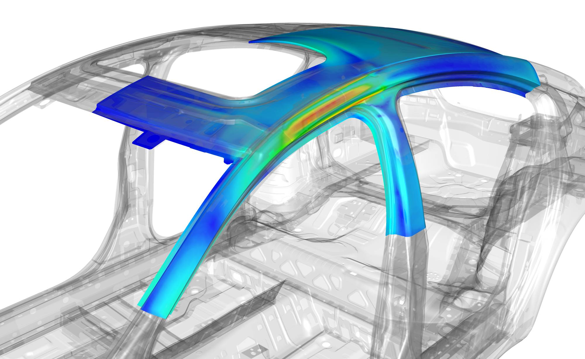
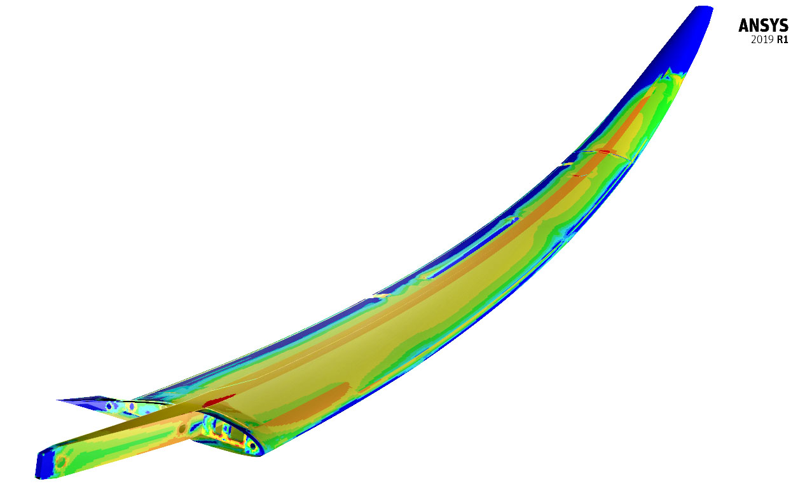

In Inventor können Ingenieure und Techniker die Belastungsanalyse verwenden, um sicherzustellen, dass Bauteile und Baugruppen den Belastungen standhalten, denen sie während ihres Betriebs ausgesetzt sind. Es ist möglich, Schwachstellen oder Bereiche zu finden, die aufgrund von zu hoher Spannung oder Deformationen nicht funktionieren könnten. Um Entscheidungen zu treffen und die Konstruktion zu verbessern, können die Ergebnisse der Belastungsanalyse in verschiedenen Formen dargestellt werden, wie beispielsweise Farbkarten, Diagramme und Berichte.

Inventor bietet eine Vielzahl von Werkzeugen zur Belastungsanalyse, darunter Finite-Elemente-Analyse (FEA) und Simulationen von dynamischen und thermischen Belastungen. Früh in der Konstruktionsphase, bevor ein physischer Prototyp hergestellt wird, wird eine Belastungsanalyse häufig verwendet, um mögliche Probleme in einem Bauteil oder einer Baugruppe zu identifizieren. Bevor ein Prototyp hergestellt wird, können potenzielle Probleme identifiziert und korrigiert werden, um Zeit und Kosten zu sparen.

Die Automobilindustrie ist ein praktisches Beispiel, wo die Belastungsanalyse angewendet wird. Ein neues Automodell muss viele Tests bestehen, bevor es auf den Markt gebracht wird, um sicherzustellen, dass es den Anforderungen der Branche und der Verbraucher entspricht. Die Belastungsanalyse ist ein Test, bei dem das Fahrzeug hohen Belastungen und Kräften ausgesetzt wird, um sicherzustellen, dass es sicher und zuverlässig ist. Es wird beispielsweise die Belastung auf die Struktur bei hohen Geschwindigkeiten oder die Kraft beim Aufprall berechnet. Die Ergebnisse der Belastungsanalyse können bei der Optimierung des Fahrzeugdesigns helfen und es sicherer und widerstandsfähiger zu machen.

Die Belastungsanalyse wird auch in der Luft- und Raumfahrtindustrie verwendet. Es ist notwendig, dass Flugzeuge, Raketen und Satelliten extremen Bedingungen wie den Kräften beim Start oder der Schwerelosigkeit im Weltraum standhalten. Die Belastungsanalyse hilft dabei, die Struktur und Materialien der Bauteile und Baugruppen so zu optimieren, dass sie diesen Belastungen standhalten können. Dadurch wird die Sicherheit von Flugzeugen und Raumfahrzeugen erhöht und das Unfallrisiko verringert.

Trotz der Fähigkeit von Inventor, die Belastung von Bauteilen und Baugruppen zu analysieren, gibt es spezialisierte Software, die für die Analyse komplexer Systeme besser geeignet ist. ANSYS ist ein Beispiel dafür, eine umfassende FEM-Software, die in verschiedenen Branchen wie der Automobil- und Raumfahrtindustrie verwendet wird. ANSYS löst komplexe Ingenieurprobleme mit Funktionen wie Strukturanalyse, Strömungsanalyse und elektromagnetischer Analyse. Es ist jedoch teurer als Inventor und erfordert mehr Training und Anwendung.

Um sicherzustellen, dass Bauteile und Baugruppen den Belastungen standhalten können, denen sie während ihres Betriebs ausgesetzt sind, ist die Belastungsanalyse ein wichtiger Bestandteil des Konstruktionsprozesses. Inventor und ANSYS sind leistungsstarke Tools, die Ingenieure und Techniker dabei unterstützen, Probleme frühzeitig zu erkennen und zu beheben, um Zeit und Kosten zu sparen und die Produktsicherheit zu erhöhen.
