In dieser Übung werden wir eine Belastungsanalyse Schritt für Schritt zusammen durchführen. Wir werden hierbei nur auf die Grundlagen eingehen, auf die nachher aufgebaut werden kann.

## Bauteil konstruieren

Bevor wir eine Belastungsanalyse durchführen können, brauchen wir ein Bauteil mit dem wir arbeiten können. Klickt <a href="https://files.conor-burns.com/docs/Stuhl.pdf" target="_blank" rel="noopener"
        role="button">hier</a> für eine technische Zeichnung von dem Bauteil mit welchem wir weiter arbeiten werden. Wenn ihr Lust habt, könnt ihr natürlich auch ein anderes Bauteil konstruieren. Das macht es euch dann ein bisschen komplizierter.
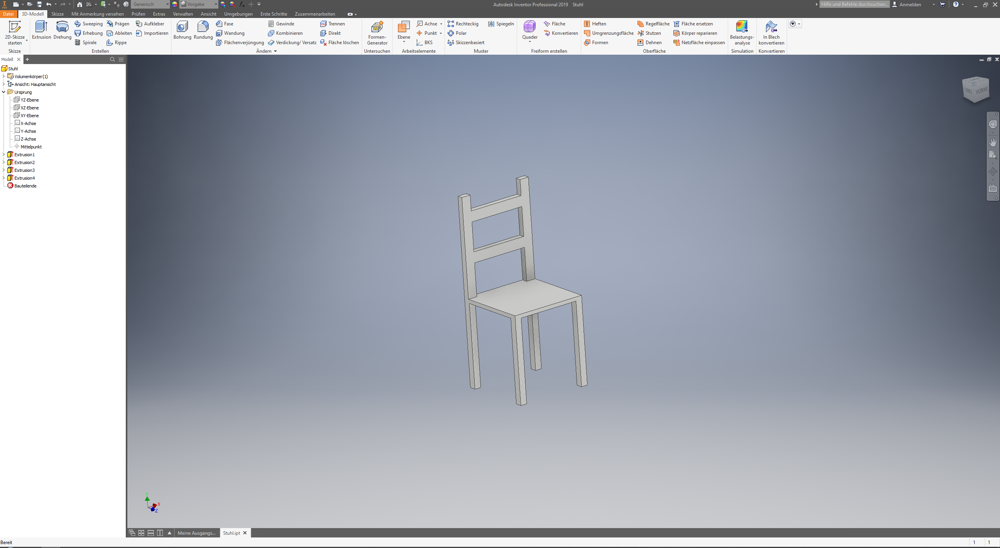

## Grundlegende Einstellungen

Nachdem ihr euer Bauteil konstruiert habt, müssen wir ein paar grundlegende Einstellungen tätigen.

In der oberen Leiste im Menü `3D-Modell` könnt ihr auf den Punkt `Belastungsanalyse` klicken.
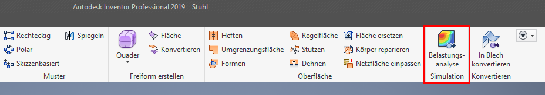

Ihr gelangt damit in ein neues Menü, mit dem wir nun weiterarbeiten können. Euch wird auffallen, dass alle Knöpfe ausgegraut sind, bis auf den `Studie Erstellen` knopf. Drückt also als nächstes auf diesen.
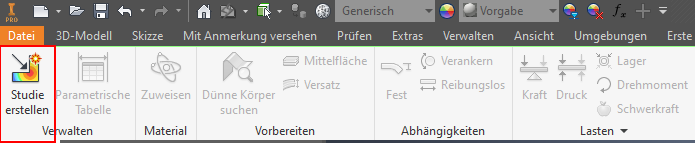

Ein Fenster öffnet sich. Hier solltet ihr oben der Studie einen Namen geben. In diesem Fall bietet sich der Name `Stuhl` an. Dann könnt ihr auf OK klicken.
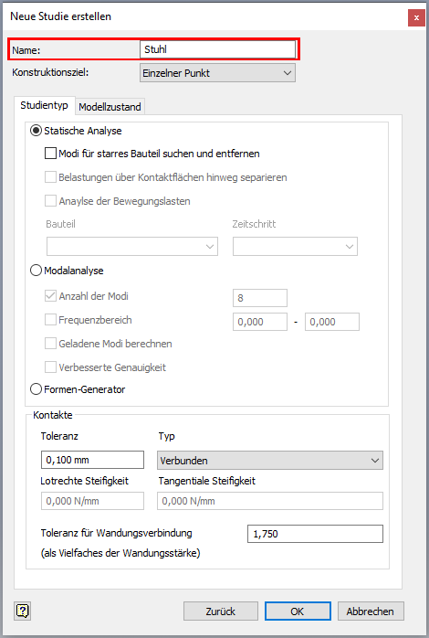

Ihr werdet nun sehen, dass sich links ein Menü öffnet. Dieses gibt euch einen Überblick über alle Informationen die Ihr für die Belastungsanalyse braucht.
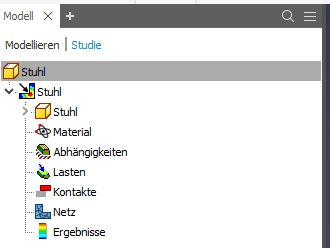

Dieses Menü ist eine sehr gute Übersicht über alles, was getan werden muss, um eine Belastungsanalyse durchzuführen.

Wir werden uns in den nächsten Schritten einfach nur durch die meisten dieser Unterpunkte arbeiten.



## Materialien festlegen

Damit Inventor weiß, welche Eigenschaften ein Bauteil hat, muss man ihm ein Material zuweisen. Hiermit werden alle technischen Daten auf unser Bauteil angewand. 



Um ein Material zuzuweisen, könnt Ihr auf den Material Reiter doppelklicken.

Damit öffnet sich ein neues Fenster, in dem Ihr für alle Komponenten Materialien zuweisen könnt. In unserem Fall haben wir nur eine Komponente, weswegen wir auch nur eine Zeile haben. Hier solltet Ihr nun in dem DropDown Menü ein Material auswählen. Welches Ihr wählt ist euch überlassen.

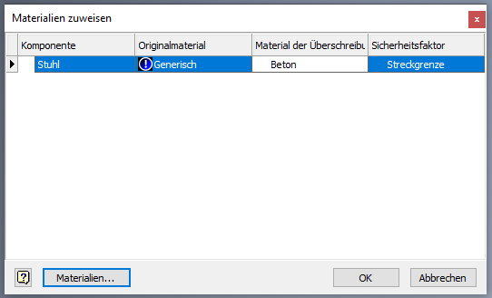

Wenn ihr euer Material ausgewählt hab, könnt ihr das Menü unten mit OK schließen.

## Abhängigkeiten definieren

Als nächstes müssen wir dem Bauteil ein paar Abhängigkeiten definieren. Inventor an sich weiß nicht, wie unser Objekt mit der Außenwelt interagiert. Um diese Informationen an Inventor zu geben, müssen wir Abhängigkeiten definieren, damit Inventor weiß, wo das Bauteil z.b. Fest verankert ist.
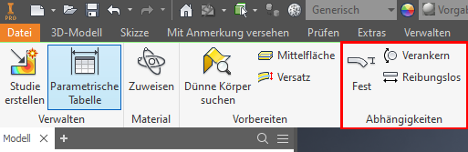

Bei unserem Stuhl bietet es sich an, die 4 Beine unten auf dem Boden zu fixieren. Dazu benutzen wir die `Fest` eigenschaft. Wenn wir diese ausgewählt haben, können wir einfach auf die 4 unteren Flächen des Stuhls drücken.

Damit weiß Inventor nun, dass sich diese 4 Flächen nicht bewegen können.



## Lasten und Belastungen definieren

Nachdem wir nun Abhängigkeiten für unser Bauteil festgelegt haben, müssen wir definieren, wo Kräfte auf unser Bauteil wirken. Hierzu haben wir unterschiedliche Lasten, die wir benutzen können.
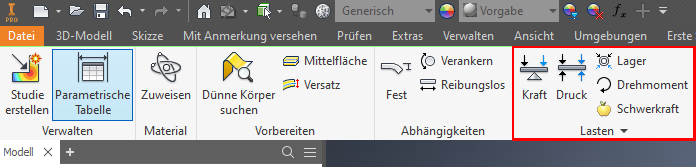

Für einen ersten Versuch, können wir eine einfache Kraft definieren. Klickt dazu einfach auf die Flächen, auf die die Kräfte wirken sollen. In unserem Beispiel lassen wir 880N auf unsere Stuhlfläche wirken, dies ist das Durchschnittsgewicht eines Menschens.
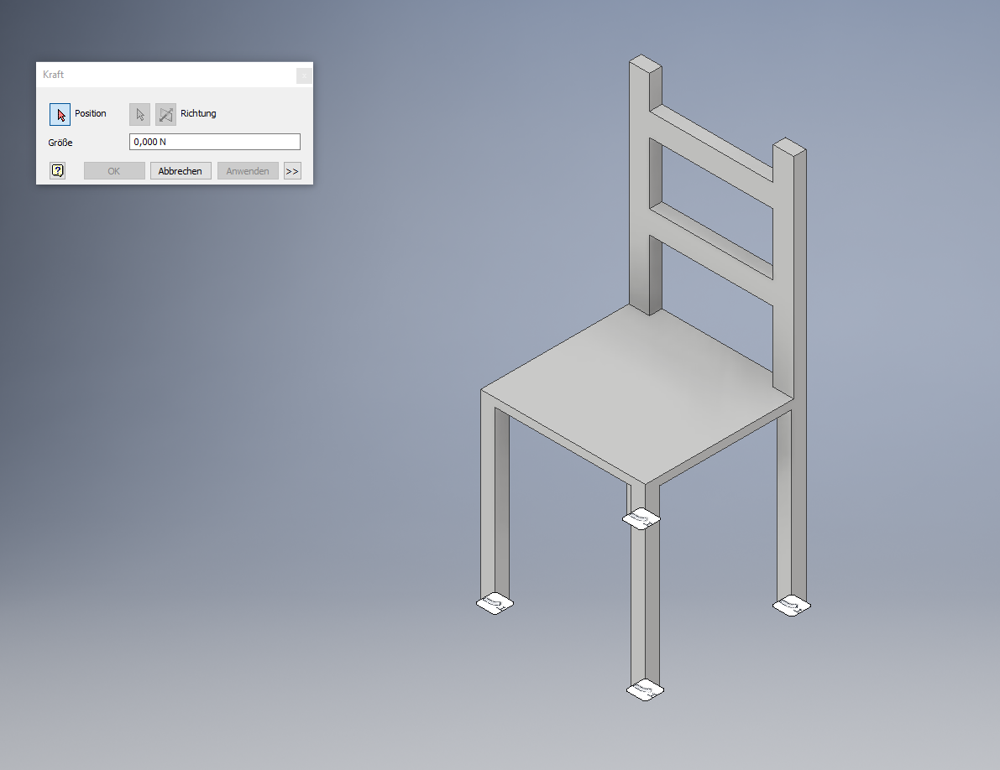

Wenn wir mehrere Lasten definieren wollen ist hierbei wieder unser Menü links hilfreich. Mit einem klick auf den kleinen Pfeil bei `Lasten` bekommen wir eine Übersicht über alle Lasten die auf unserem Bauteil wirken. Dadurch bekommen wir einen guten Überblick und können im Nachhinein einfach unsere Kräfte bearbeiten. 
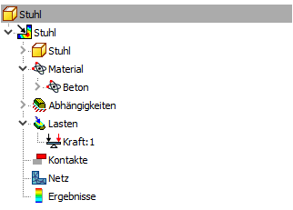

## Durchführung der Simulation
Nun haben wir alles definiert, was wir für eine Belastungsanalyse brauchen. Jetzt müssen wir einfach nur noch auf `Simulieren` drücken und Inventor erstellt uns eine Belastungsanalyse.
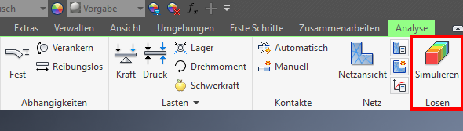

Danach bekommen wir eine Ansicht, die ungefähr so aussehen kann.
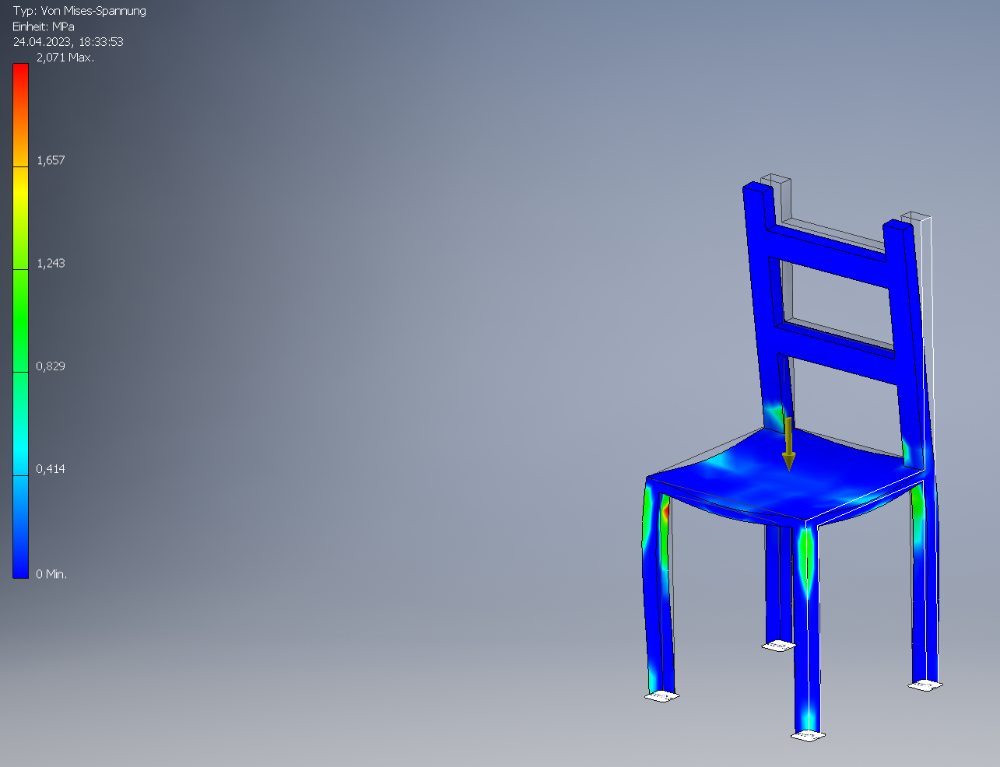

Hierbei sehen wir nun, dass Inventor uns unser Bauteil eingefärbt hat. Links in der Legende sehen wir auch, was die Farben zu bedeuten haben. Auch sehen wir eine Outline von unserem originalem Bauteil. Dadurch können wir schön sehen, dass sich unsere Stuhllehne nach vorne geknickt hat.



## Netze
Wenn wir unsere Analyse erstellt haben, haben wir noch die Möglichkeit eine Netzansicht auszuwählen. 
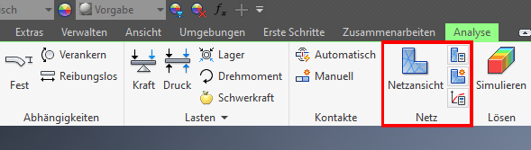

Danach wird unser Bauteil so aussehen. Wir können mit einer Netzansicht viel besser sehen, wie sich unser Bauteil verformt hat.
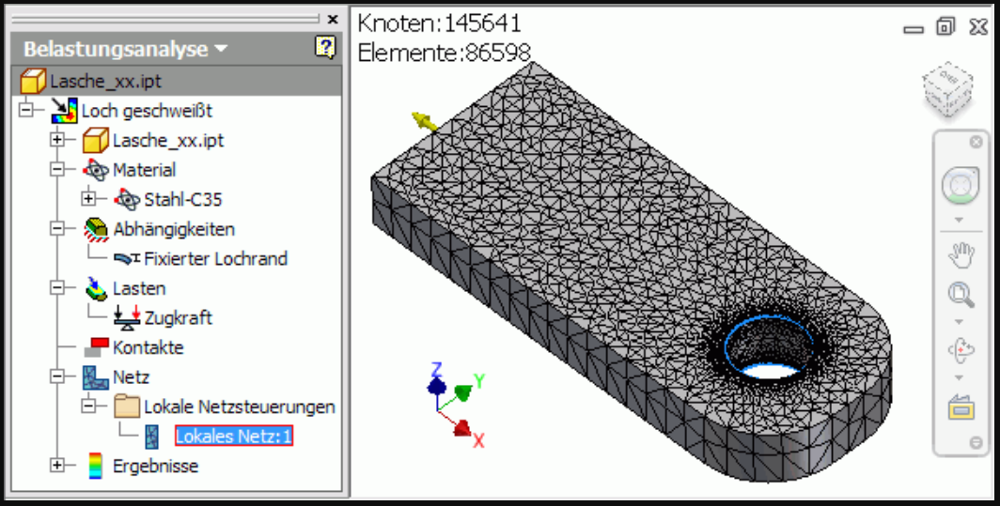
