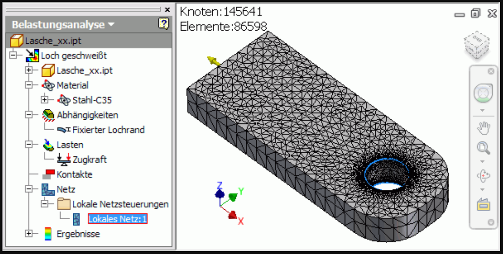

Die Belastungsanalyse ist ein wichtiger Teil des Konstruktionsprozesses, da sie es den Konstrukteuren ermöglichen, das Verhalten eines Produktes unter verschiedenen Belastungen zu Verstehen. Dadurch kann man sicherstellen, dass das Produkt robust ist und am Ende den Anforderungen des Kunden entspricht.

Im Unteren Bild sieht man zum Beispiel eine Lasche aus C35 Stahl. Mit Hilfe der Belastungsanalyse können wir hier also testen, ob diese Lasche den Anforderungen standhalten könnte.

Zusätzlich kann die Belastungsanalyse Designs optimieren um Material- und Produktionskosten zu reduzieren, ohne dabei die Leitung des Produktes zu beeinträchtigen.