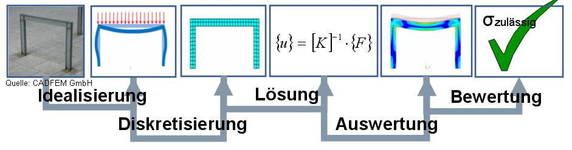

## Nachteile
- Ungenaue Modelle können zu ungenauen Ergebnissen führen
- Ungenaue Materialdaten können die Genauigkeit der Ergebnisse beeinträchtigen
- Vereinfachte Annahmen können ungenaue Ergebnisse liefern, wenn sie nicht korrekt sind
- Komplexe Geometrien erfordern zusätzliche Arbeit, um genaue Ergebnisse zu validieren
- Belastungsanalysen erfordern oft viel Rechenleistung, insbesondere bei komplexen Modellen
- Es ist wichtig, über ausreichende Kenntnisse in der Ingenieurwissenschaft zu verfügen, um die Ergebnisse angemessen zu interpretieren und zu nutzen.

## Fehleranfälligkeit
Der Prozessüberblick beschreibt den Ablauf einer Belastungsanalyse und identifiziert die jeweiligen Fehleranfälligkeiten in den verschiedenen Schritten.

- Die erste Stufe des Prozesses ist die Idealisierung, bei der das System in ein abstraktes Modell umgewandelt wird. Die Fehleranfälligkeit in diesem Schritt ist sehr hoch, da eine ungenaue Darstellung des Systems zu ungenauen Ergebnissen führen kann.

- Die zweite Stufe ist die Diskretisierung, bei der das Modell in diskrete Elemente unterteilt wird. Die Fehleranfälligkeit in diesem Schritt ist moderat, da eine ungenaue Diskretisierung zu Ungenauigkeiten in den Ergebnissen führen kann.

- Die dritte Stufe ist die Lösung, bei der die Gleichungen des Modells gelöst werden, um die Belastung des Systems zu berechnen. Die Fehleranfälligkeit in diesem Schritt ist sehr gering, da die Lösungen der Gleichungen in der Regel präzise sind.

- Die vierte Stufe ist die Auswertung, bei der die Ergebnisse der Lösung analysiert werden. Die Fehleranfälligkeit in diesem Schritt ist gering, da eine falsche Interpretation der Ergebnisse zu falschen Schlussfolgerungen führen kann.

- Die fünfte Stufe ist die Bewertung, bei der die Ergebnisse bewertet werden, um Entscheidungen zu treffen. Die Fehleranfälligkeit in diesem Schritt ist hoch, da eine falsche Bewertung der Ergebnisse zu ungenauen Entscheidungen führen kann.

- Es ist wichtig zu beachten, dass die Genauigkeit der Ergebnisse einer Belastungsanalyse von vielen Faktoren abhängt, einschließlich der Genauigkeit des Modells, der Materialdaten, der Annahmen und der Komplexität der Geometrie. Es ist daher wichtig, über ausreichende Kenntnisse in der Ingenieurwissenschaft zu verfügen, um die Ergebnisse angemessen zu interpretieren und zu nutzen.
