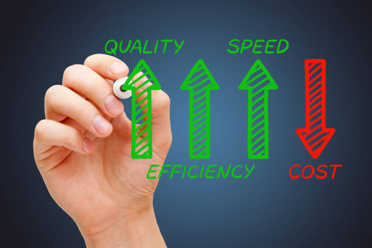

- Schnellere Produktentwicklung
- Reduzierte Kosten
- Bessere Produktleistung
- Bessere Produktzuverlässigkeit
- Sicherheitsverbesserungen

Die genannten Faktoren sind stark miteinander verknüpft.
Zum Beispiel führen eine schnelleren Entwicklung und eine bessere Produktleistung zwangsläufig zu sinkende Kosten.
